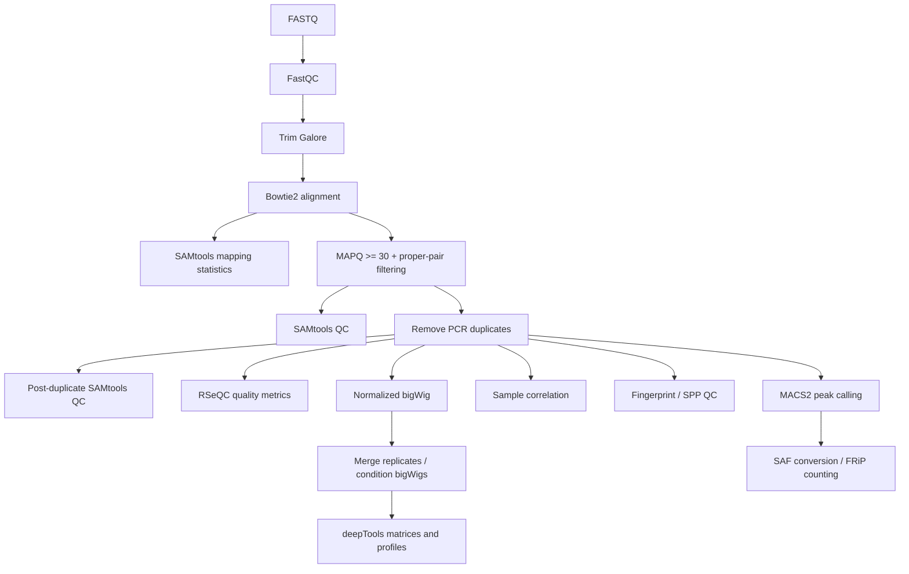
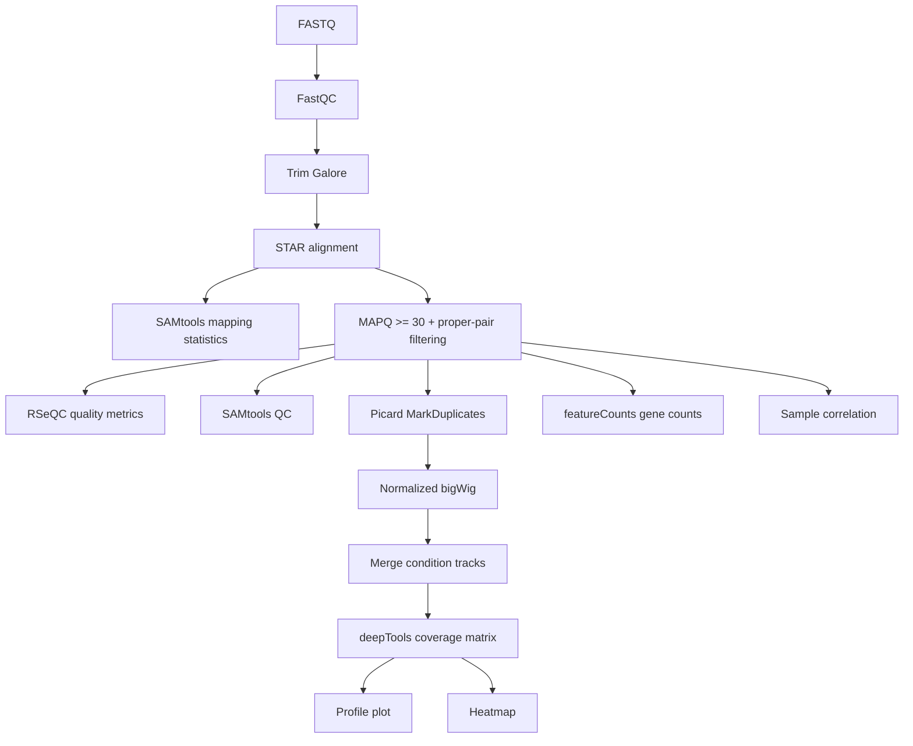
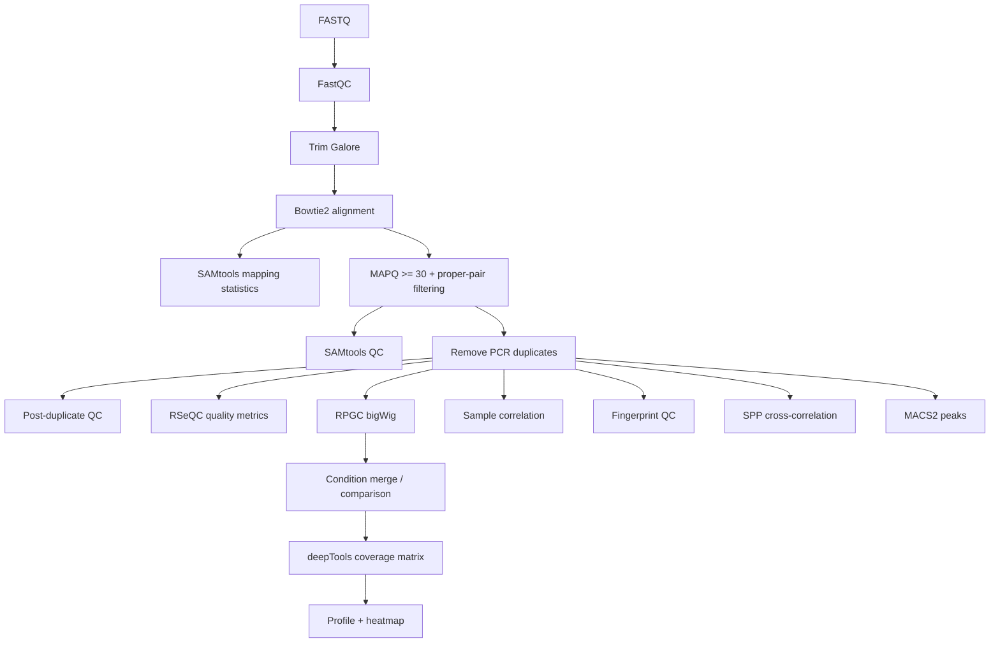

# Bempedoic-acid-binds-PPAR-and-reprograms-the-Hepatic-Epigenetic-Transcriptional-and-Metabolic-states

# Snakemake pipelines for ChIP-seq, RNA-seq and ATAC-seq

This repository contains three Snakemake workflows for processing paired-end next-generation sequencing data:

- **ChIP-seq** (`Chip-Seq_Analysis/`)
- **RNA-seq** (`RNA-Seq_Analysis/`)
- **ATAC-seq** (`ATAC-Seq/`)

The workflows share a common structure for FASTQ quality control, trimming, alignment, mapping-quality filtering, BAM-level quality control, coverage-track generation and sample correlation. ChIP-seq and ATAC-seq additionally contain peak-oriented quality-control and peak-calling steps, while RNA-seq performs gene-level read counting.

> **Important:** the workflows are configured directly in each `Snakefile`. There is no separate `config.yaml` in the archive. Review and edit the variables at the beginning of the relevant `Snakefile` before running a pipeline.

---

## 1. Repository layout

```text
Archive/
├── ATAC-Seq/
│   ├── Snakefile
│   ├── ATACSeqMambaEnv.yml
│   └── lib/scripts/
├── Chip-Seq_Analysis/
│   ├── Snakefile
│   ├── ChIPSeqMambaEnv.yml
│   └── lib/scripts/
└── RNA-Seq_Analysis/
    ├── Snakefile
    ├── RNASeqMambaEnv.yml
    └── lib/scripts/
```

Each workflow calls Python helper scripts in `lib/scripts/` through Snakemake's `script:` directive. The Conda/Mamba environment files contain the external bioinformatics programs required by those scripts.

---

## 2. General requirements

### Snakemake

The Snakefiles explicitly require **Snakemake >= 6.0**:

```python
from snakemake.utils import min_version
min_version("6.0")
```

A more recent Snakemake release may work, but these workflows were written against the Snakemake 6-era syntax and should be tested after major-version upgrades.

### Conda/Mamba environments

The supplied environments contain tools such as:

- FastQC
- Trim Galore / Cutadapt
- Bowtie2 for ChIP-seq and ATAC-seq
- STAR for RNA-seq
- SAMtools
- Picard
- deepTools
- RSeQC
- featureCounts/Subread
- MACS2 for peak calling
- phantompeakqualtools/SPP

Create environments with either Conda or Mamba/Micromamba. For example:

```bash
micromamba env create -f ATACSeqMambaEnv.yml
micromamba env create -f ChIPSeqMambaEnv.yml
micromamba env create -f RNASeqMambaEnv.yml
```

Snakemake can also create/use environments referenced by `conda:` when the workflow is launched with `--use-conda`.

### Input read naming

The code is primarily written for **paired-end** data (`PairedEnd = True`). FASTQ files are sorted lexicographically and paired by adjacent entries. Therefore, use a consistent naming convention in which R1 and R2 sort next to one another, for example:

```text
Sample01_R1.fastq.gz
Sample01_R2.fastq.gz
Sample02_R1.fastq.gz
Sample02_R2.fastq.gz
```

The `FileManagement` helper strips `.fastq.gz` and assumes paired files occur in alternating positions. Avoid unrelated files in the FASTQ condition directories.

---

## 3. Running a workflow

Run Snakemake **from the directory containing the selected `Snakefile`**, because the workflows use relative paths such as `../../data/...`, `../../output/...`, and `lib/scripts/...`.

A typical dry run is:

```bash
cd ATAC-Seq
snakemake -n --cores 8 --use-conda
```

Run the workflow after reviewing the dry-run DAG:

```bash
snakemake --cores 8 --use-conda
```

Equivalent commands can be used from `Chip-Seq_Analysis/` or `RNA-Seq_Analysis/`.

Useful Snakemake options include:

```bash
# Print commands
snakemake --cores 8 --use-conda -p

# Rerun jobs whose code changed
snakemake --cores 8 --use-conda --rerun-triggers mtime

# Generate a DAG image if Graphviz is installed
snakemake --dag | dot -Tpdf > dag.pdf
```

---

# 4. ChIP-seq pipeline

## 4.1 Purpose

The ChIP-seq workflow processes paired-end ChIP-seq/CUT&RUN-like data from raw FASTQ files to filtered BAMs, normalized bigWig tracks, QC summaries, correlations, enrichment profiles and peaks. It can optionally associate treatment samples with an input/control dataset.

## 4.2 Configuration

Edit the variables near the top of `Chip-Seq_Analysis/Snakefile`.

| Variable | Meaning | Value in archive |
|---|---|---|
| `ChIPType` | Subdirectory/technology name below the ChIP-seq FASTQ directory | `""` |
| `DATASET` | Dataset path/name | `"RichardData/ESC"` |
| `INPUTDATASET` | Optional separate input/control dataset | `""` |
| `DATATYPE` | Experimental condition folders | `["Control"]` |
| `DatasetCtrlAbrevInFile` | Filename substring used to identify control samples | `"ESC_Kat5_"` |
| `referenceGenome` | Reference genome FASTA | mouse GRCm38 primary assembly path |
| `genomeIndexFolder` | Bowtie2 index directory | mouse index path |
| `bedGenesFiles` | BED annotation used by QC/deepTools | mouse GRCm38 BED path |
| `peaksCallingType` | Label used in peak-calling output directories | `'None'` |
| `peaksCallingMergedBam` | Whether peak calling should use merged BAMs | `False` |
| `PairedEnd` | Paired-end mode | `True` |
| `organism` | Bowtie2/MACS-related organism label | `"mm"` |
| `typeheatmap` | deepTools matrix mode | `"geneBody"` |
| `cpusPerTasks` | Threads passed to many helper commands | `60` |

The ChIP-seq input root is constructed as:

```text
../../data/Chip-Seq/Fastq/<ChIPType>/<DATASET>/<condition>/
```

For example:

```text
data/Chip-Seq/Fastq/
└── CUTRUN/
    └── Experiment_01/
        ├── Control/
        │   ├── Ctrl_rep1_R1.fastq.gz
        │   └── Ctrl_rep1_R2.fastq.gz
        └── Treatment/
            ├── Treat_rep1_R1.fastq.gz
            └── Treat_rep1_R2.fastq.gz
```

Set, for example:

```python
ChIPType = "CUTRUN"
DATASET = "Experiment_01"
DATATYPE = ["Control", "Treatment"]
DatasetCtrlAbrevInFile = "Ctrl"
```

## 4.3 Workflow



### Main processing rules

1. **`fastQCBeforeTrim`** - runs FastQC on raw `.fastq.gz` reads.
2. **`TrimGalore`** - adapter/quality trimming with Trim Galore.
3. **`MappingReadsOnGenome`** - aligns paired reads with Bowtie2. If necessary, the helper script can build a Bowtie2 index with `bowtie2-build`.
4. **`samStatMapping`** - generates `samtools stats` and `samtools flagstat` reports for mapped reads.
5. **`MAPQ`** - converts SAM to sorted BAM while retaining properly paired reads with mapping quality >= 30 (`samtools view -q 30 -f2`).
6. **`samStatMAPQ`** - QC after mapping-quality filtering.
7. **`removePCRDuplicates`** - removes duplicates with Picard `MarkDuplicates REMOVE_DUPLICATES=true`, then indexes the BAM.
8. **`samStatPCRDuplicates`** - QC after duplicate removal.
9. **`QualControl`** - runs RSeQC/SAMtools-based metrics, including strand inference, chromosome-level mapping/coverage information, gene-body coverage and read distribution.
10. **`bamCoverage`** - creates RPGC-normalized bigWigs with deepTools `bamCoverage`, using 25-bp bins and an effective genome size calculated from the FASTA.
11. **`bigWigMerge`** - merges replicate BAMs with `samtools merge`, indexes them, generates condition-level bigWigs and, when applicable, performs a deepTools `bigwigCompare`.
12. **`correlationBamPlot`** - creates a deepTools `multiBamSummary` result, Spearman correlation matrix and correlation plot.

### ChIP-specific QC and peak analysis

Depending on `DATASET`, `INPUTDATASET`, number of conditions and related flags, the Snakefile conditionally enables:

- **`plotFingerPrint`** - deepTools fingerprint/Lorenz-style enrichment QC.
- **`SPP`** - strand cross-correlation QC with `run_spp.R` from phantompeakqualtools.
- **`coveraGeMatrix`** - deepTools `computeMatrix` around a reference point or scaled regions.
- **`profilePlotTSS`** - deepTools profile plot.
- **`heatmapPlotTSS`** - deepTools heatmap.
- **`PeaksCalling`** - MACS2 peak calling with paired-end BAM input and `--nomodel`; optional input/control BAM support is implemented.
- **`convertBedToSaf`** - converts peak intervals to SAF format.
- **`FripScoreComputing`** - uses featureCounts to count fragments overlapping peaks for FRiP-related output.

> The ChIP-seq MACS2 helper currently hard-codes `-g hs` in its command even though the Snakefile default reference paths point to mouse. Review `lib/scripts/MACS2.py` before using peak calling for mouse data.

## 4.4 Major outputs

Outputs are written below:

```text
../../output/Chip-Seq/<ChIPType>/<DATASET>/
```

Important subdirectories include:

- `FastQC/` - raw-read FastQC HTML/ZIP reports
- `Trimming/` - trimmed FASTQ files
- `Mapping/` - Bowtie2 SAM files
- `MAPQ/` - MAPQ-filtered BAMs
- `NoDup/` - duplicate-removed BAMs, indexes and Picard metrics
- `SamStatsMapping/`, `SamStatsMAPQ/`, `SamStatsPCRDuplicates/` - mapping reports
- `QualControlMetricsFiles/` - RSeQC/SAMtools QC outputs
- `bigWig/` - per-sample bigWigs
- `BamFilesMerged/` - merged replicate BAMs
- `BigWigMerge/` - condition-level coverage tracks
- `CorrelationBamPlot/` - sample-correlation plots/matrices
- `Fingerprints/` - fingerprint plots and raw counts
- `StrandCorrelations/` - SPP cross-correlation results
- `PeaksCalling/` - MACS2 narrowPeak output
- `FRIPScore/` - SAF/featureCounts-based peak-overlap output
- `CoverageMatrixFiles/` - matrices, heatmaps and profiles

---

# 5. RNA-seq pipeline

## 5.1 Purpose

The RNA-seq workflow processes paired-end RNA-seq reads from FASTQ through trimming, STAR alignment, BAM filtering, QC, normalized coverage tracks, sample correlations, aggregate gene/TSS profiles and featureCounts gene-level quantification.

## 5.2 Configuration

Edit `RNA-Seq_Analysis/Snakefile`.

| Variable | Meaning | Value in archive |
|---|---|---|
| `DATASET` | Dataset directory | `""` |
| `DATATYPE` | Condition directories | `["", ""]` |
| `DatasetCtrlAbrevInFile` | Control identifier used when sorting samples | `"MCtrl"` |
| `referenceGenome` | Genome FASTA | mouse GRCm38/mm10 path |
| `referenceGTF` | Gene annotation GTF | Gencode vM10 path |
| `bedGenesFiles` | BED annotation for RSeQC/deepTools | mouse GRCm38 BED path |
| `PairedEnd` | Paired-end mode | `True` |
| `typeheatmap` | deepTools matrix mode | `"TSS"` |
| `readsstrandness` | featureCounts strandedness selection | `"bothsense"` |
| `cpusPerTasks` | Threads passed to helper commands | `3` |

Input directories are expected under:

```text
../../data/RNA-Seq/<DATASET>/<condition>/
```

Example:

```text
data/RNA-Seq/
└── Experiment_01/
    ├── Control/
    │   ├── Ctrl_rep1_R1.fastq.gz
    │   └── Ctrl_rep1_R2.fastq.gz
    └── Treatment/
        ├── Treat_rep1_R1.fastq.gz
        └── Treat_rep1_R2.fastq.gz
```

Configuration example:

```python
DATASET = "Experiment_01"
DATATYPE = ["Control", "Treatment"]
DatasetCtrlAbrevInFile = "Ctrl"
readsstrandness = "bothsense"
```

## 5.3 Workflow



### Rules

1. **`fastQCBeforeTrim`** - FastQC on raw FASTQs.
2. **`TrimGalore`** - paired-end trimming. The RNA workflow requests uncompressed trimmed FASTQ outputs for the STAR step.
3. **`MappingReadsOnGenome`** - builds/uses a STAR genome index and aligns paired-end reads. The reference GTF is supplied during genome-index generation.
4. **`samStatMapping`** - SAMtools alignment statistics.
5. **`MAPQ`** - creates coordinate-sorted BAMs, retaining proper pairs with MAPQ >= 30; BAM indexes are also generated.
6. **`QualControl`** - RSeQC/SAMtools QC, including strand inference, `idxstats`, gene-body coverage and read distribution.
7. **`samStatMAPQ`** - statistics after MAPQ filtering.
8. **`MarkPCRDuplicates`** - Picard duplicate marking/metrics. Unlike the ChIP/ATAC helper, the RNA helper does not use `REMOVE_DUPLICATES=true`; duplicates are marked in the output BAM rather than explicitly removed.
9. **`bamCoverage`** - deepTools RPGC-normalized coverage in 25-bp bins.
10. **`bigWigMerge`** - merges BAM replicates and creates condition-level bigWig tracks.
11. **`correlationBamPlot`** - multiBamSummary plus Spearman sample-correlation plots/matrices.
12. **`coveraGeMatrix`** - deepTools `computeMatrix`, conditionally using reference-point or scale-region mode according to the workflow configuration.
13. **`profilePlotTSS`** - aggregate signal profile.
14. **`heatmapPlotTSS`** - signal heatmap.
15. **`countingGenes`** - featureCounts gene-level counting from the MAPQ-filtered BAMs using `referenceGTF`.

### featureCounts strandedness

`readsstrandness` controls the `-s` argument used by featureCounts:

- `sense` -> `-s 1`
- `antisense` -> `-s 2`
- `bothsense` -> `-s 0` (unstranded)

The counting script also uses `-p` for paired-end fragment counting.

## 5.4 Major outputs

Outputs are written below:

```text
../../output/RNA-Seq/<DATASET>/
```

Main output groups include:

- `FastQC/`
- `Trimming/`
- `Mapping/`
- `MAPQ/`
- `NoDup/` (the name is inherited from the shared workflow structure even though the RNA code marks duplicates)
- `QualControlMetricsFiles/`
- `bigWig/`
- `BamFilesMerged/`
- `BigWigMerge/`
- `MultiBamFolder/`
- `CorrelationBamPlot/`
- `CoverageMatrixFiles/`
- `ReadsCounts/` - featureCounts output

---

# 6. ATAC-seq pipeline

## 6.1 Purpose

The ATAC-seq workflow processes paired-end chromatin-accessibility reads through Bowtie2 alignment, stringent BAM filtering, duplicate removal, library-level QC, normalized coverage tracks, replicate/condition aggregation, sample correlation, enrichment QC, SPP cross-correlation, aggregate profiles and MACS2 peak calling.

## 6.2 Configuration

Edit `ATAC-Seq/Snakefile`.

| Variable | Meaning | Value in archive |
|---|---|---|
| `DATASET` | Dataset directory | `""` |
| `INPUTDATASET` | Optional input/control dataset setting | `""` |
| `DATATYPE` | Condition folders | `['Control', 'BA']` |
| `DatasetCtrlAbrevInFile` | Substring identifying control samples | `"Ctrl"` |
| `referenceGenome` | Genome FASTA | mouse FASTA path |
| `genomeIndexFolder` | Bowtie2 index directory | mouse index path |
| `bedGenesFiles` | BED annotation | mouse GRCm38 BED path |
| `peaksCallingType` | Peak-calling output label | `'None'` |
| `PairedEnd` | Paired-end mode | `True` |
| `organism` | MACS2 genome-size shortcut | `"mm"` |
| `typeheatmap` | deepTools matrix mode | `"TSS"` |
| `cpusPerTasks` | Threads passed to helper commands | `6` |

Input FASTQs are expected under:

```text
../../data/ATAC-Seq/Fastq/<DATASET>/<condition>/
```

Example:

```text
data/ATAC-Seq/Fastq/
└── Experiment_01/
    ├── Control/
    │   ├── Ctrl_rep1_R1.fastq.gz
    │   └── Ctrl_rep1_R2.fastq.gz
    └── BA/
        ├── BA_rep1_R1.fastq.gz
        └── BA_rep1_R2.fastq.gz
```

## 6.3 Workflow



### Rules

The ATAC-seq core processing is almost identical to ChIP-seq:

1. **`fastQCBeforeTrim`** - FastQC on raw reads.
2. **`TrimGalore`** - paired-end adapter/quality trimming.
3. **`MappingReadsOnGenome`** - Bowtie2 alignment with `--no-unal`; the helper can build the Bowtie2 index when required.
4. **`samStatMapping`** - `samtools stats` and `flagstat`.
5. **`MAPQ`** - retains properly paired reads with MAPQ >= 30 and sorts them into BAM.
6. **`samStatMAPQ`** - post-filter QC.
7. **`removePCRDuplicates`** - Picard duplicate removal plus BAM indexing.
8. **`samStatPCRDuplicates`** - post-deduplication statistics.
9. **`QualControl`** - RSeQC/SAMtools metrics.
10. **`bamCoverage`** - 25-bp RPGC-normalized bigWig.
11. **`bigWigMerge`** - replicate BAM merging, merged bigWigs and optional condition comparison.
12. **`correlationBamPlot`** - deepTools sample correlation.
13. **`plotFingerPrint`** - deepTools fingerprint plot.
14. **`SPP`** - phantompeakqualtools strand cross-correlation.
15. **`coveraGeMatrix`** - deepTools matrix around TSS/reference regions.
16. **`profilePlotTSS`** - aggregate accessibility profile.
17. **`heatmapPlotTSS`** - accessibility heatmap.
18. **`PeaksCalling`** - MACS2 paired-end peak calling using `-f BAMPE --nomodel` and the configured organism shortcut.

The archive also includes ATAC helper scripts for BED-to-SAF conversion and FRiP calculation, although the corresponding FRiP outputs are commented out of the ATAC `rule all` target in the supplied Snakefile.

## 6.4 Major outputs

Outputs are written below:

```text
../../output/ATAC-Seq/<DATASET>/
```

Important groups include:

- `FastQC/`
- `Trimming/`
- `Mapping/`
- `MAPQ/`
- `NoDup/`
- `SamStatsMapping/`, `SamStatsMAPQ/`, `SamStatsPCRDuplicates/`
- `QualControlMetricsFiles/`
- `bigWig/`
- `BamFilesMerged/`
- `BigWigMerge/`
- `BigWigCompare/`
- `MultiBamFolder/`
- `CorrelationBamPlot/`
- `Fingerprints/`
- `StrandCorrelations/`
- `PeaksCalling/`
- `CoverageMatrixFiles/`
- `FRIPScore/` and `BedFiles/` directories may be created even when FRiP targets are not active in `rule all`

---

# 7. Shared QC metrics

The `QualCheck.py` scripts use a combination of RSeQC and SAMtools. Depending on the exact helper version, generated metrics include:

- **Library strandness / experiment inference** (`infer_experiment.py`)
- **Per-reference mapping statistics** (`samtools idxstats`)
- **Gene-body coverage** (`geneBody_coverage.py`)
- **Read distribution across genomic features** (`read_distribution.py`)

For ChIP-seq and ATAC-seq, some RNA-centric RSeQC metrics may be less biologically informative than assay-specific metrics such as FRiP, fingerprint curves, TSS enrichment and peak/cross-correlation metrics. Interpret them accordingly.

---

# 8. Reference files

Before running a workflow, make sure the paths in the Snakefile point to real files on the machine.

### ChIP-seq / ATAC-seq

Required or expected references include:

- reference genome FASTA
- writable Bowtie2 index directory or an existing Bowtie2 index
- BED gene/region annotation

### RNA-seq

Required references include:

- reference genome FASTA
- GTF gene annotation
- BED annotation for QC/profile calculations

The RNA helper constructs a STAR index from the reference genome/GTF when needed.

---

# 9. Important portability and code-review notes

Review these items before deploying the archive on another machine.

1. **RNA environment filename mismatch.** `RNA-Seq_Analysis/Snakefile` sets:

   ```python
   condaEnvironment = "RNASeqAnalysisForServer.yml"
   ```

   but the supplied archive contains `RNASeqMambaEnv.yml`. Either rename the YAML file or change the Snakefile to:

   ```python
   condaEnvironment = "RNASeqMambaEnv.yml"
   ```

2. **Hard-coded micromamba paths.** The ChIP-seq and ATAC-seq Snakefiles define absolute paths such as:

   ```text
   /media/sheikhhpc/.../micromamba/envs/ChIPSeqEnv
   /media/sheikhhpc/.../micromamba/envs/ATACSeqEnv
   ```

   These are used by the SPP helper to locate `run_spp.R`. Replace them with the local environment path, or refactor the script to resolve `run_spp.R` from `$PATH`.

3. **RNA hard-coded Conda environment path.** The RNA Snakefile also contains:

   ```python
   CondaEnvPathName = "~/micromamba/envs/ChIPAnalysisMamba"
   ```

   This name is inconsistent with the RNA workflow and should be reviewed if the variable becomes relevant to an enabled rule.

4. **ChIP MACS2 genome shortcut.** `Chip-Seq_Analysis/lib/scripts/MACS2.py` uses `-g hs` even when the default reference is mouse. Change this for the intended organism or pass the configured organism variable through consistently.

5. **Configuration lives in code.** Dataset names, conditions, reference paths, CPU settings and assay options are Python variables inside each Snakefile. For reproducible multi-project use, consider moving these settings to YAML configuration files.

6. **Paired-end ordering assumption.** `FileManagement.py` sorts directory contents and groups adjacent files into paired-end samples. Keep directories clean and filenames consistently sortable as R1/R2 pairs.

7. **Large per-task CPU defaults.** The ChIP-seq pipeline sets `cpusPerTasks = 60`. Reduce this on workstations or small compute nodes.

8. **Output directories are created while parsing the Snakefile.** The Snakefiles call `mkdir -p` before rule execution. A dry run can therefore still create output directories.

9. **ATAC FRiP is not currently a final target.** FRiP-related helper scripts/directories are present, but the ATAC Snakefile comments out the FRiP outputs in `outputListRule`.

10. **Assay-specific best practices should be reviewed.** For example, the current ATAC workflow does not visibly implement mitochondrial-read removal or explicit Tn5 insertion-site shifting in its main rule chain. Add such steps if required by the analysis protocol.

---

# 10. Minimal pre-run checklist

Before launching any of the three pipelines:

- Edit the dataset and condition variables in the Snakefile.
- Confirm paired FASTQ files are named and sorted consistently.
- Confirm all reference FASTA/GTF/BED paths exist.
- Confirm the output parent directory is writable.
- Correct the RNA Conda YAML filename mismatch.
- Replace machine-specific micromamba paths used by SPP.
- Confirm the organism/genome setting used by MACS2.
- Adjust `cpusPerTasks` to the available hardware.
- Run `snakemake -n --use-conda --cores <N>` first.
- Inspect the planned jobs before starting the full workflow.

---

# 11. Tool summary

| Stage | ChIP-seq | RNA-seq | ATAC-seq |
|---|---|---|---|
| Raw-read QC | FastQC | FastQC | FastQC |
| Trimming | Trim Galore | Trim Galore | Trim Galore |
| Alignment | Bowtie2 | STAR | Bowtie2 |
| MAPQ/proper-pair filtering | SAMtools | SAMtools | SAMtools |
| Duplicate handling | Picard, remove | Picard, mark | Picard, remove |
| General QC | SAMtools + RSeQC | SAMtools + RSeQC | SAMtools + RSeQC |
| Coverage tracks | deepTools bamCoverage | deepTools bamCoverage | deepTools bamCoverage |
| Replicate merge | SAMtools | SAMtools | SAMtools |
| Sample correlation | deepTools | deepTools | deepTools |
| Aggregate profiles | deepTools | deepTools | deepTools |
| Fingerprint QC | Yes | No | Yes |
| SPP cross-correlation | Yes | No | Yes |
| Peak calling | MACS2 | No | MACS2 |
| FRiP-related counting | Yes | No | Helpers present; final targets disabled | 
| Gene counting | No | featureCounts | No |

